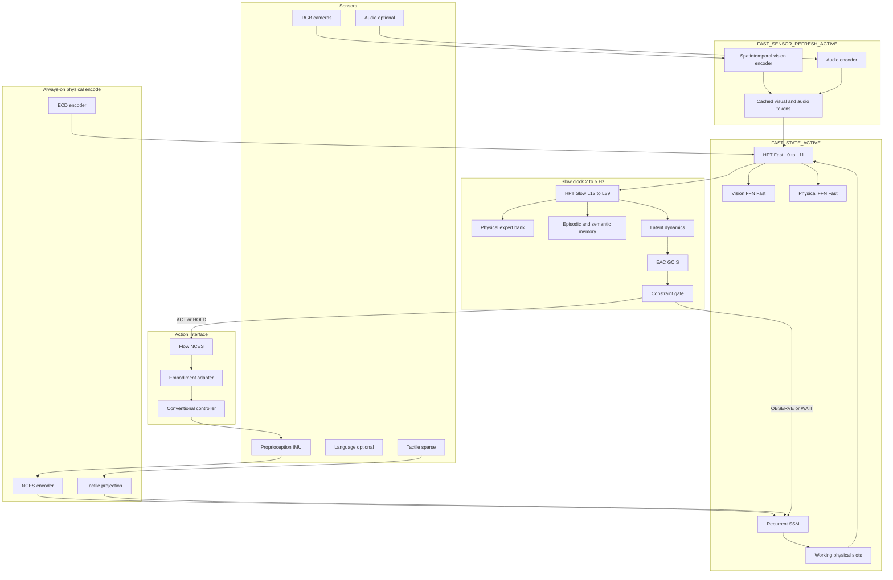

# NULLXES AMATERASU

## Embodied Agency Foundation Model (EAFM)

### Research Architecture Specification v0.1

**Author:** MagistrTheOne | NULLXES  
**Document date:** 28 August 2026  
**Design baseline:** 27 August 2026 architecture review; freeze approval 28 August 2026  

**AMATERASU-32B:** ARCHITECTURE FROZEN  
**Universal parameters:** 31,740,290,560  
**AMATERASU-72B:** APPROVED SCALE TARGET / SCALE SPECIFICATION (71,689,455,872 parameters). Not a final architecture freeze until 32B scaling evidence exists.

Roadmap: **AMATERASU-32B → AMATERASU-72B**. Do not replace either target with a smaller foundation model.

Claim tags used throughout: **VERIFIED**, **ESTIMATE**, **HYPOTHESIS**, **UNVERIFIED**.

Checkpoint convention: all transformer-block, encoder, expert, embedding, SSM, dynamics, EAC, flow, and ECD weights are stored in **safetensors** from initialization onward. Pickle/pth state_dicts are not the AMATERASU source-of-truth format.

---

## A. Executive Architecture Decision

AMATERASU is a **from-scratch Embodied Agency Foundation Model**. It is not a fine-tuned VLM, not an LLM with a robotics head, not a π0 / GR00T / OpenVLA / RT-2 / Cosmos / Qwen / Llama / Gemma derivative, and not a wrapper around MINAKANUSHI, CERBER, POSEIDON, DMI, or any other legacy NULLXES module.

Its job is to remain a physical agent when `instruction = NULL`. The operating loop is:

Observation → persistent physical state → candidate intent → predicted consequence → constraint evaluation → **ACT** or **OBSERVE / HOLD / WAIT** → state update → memory → next intent.

Agency is an engineering property: persistent state, endogenous candidate intents, consequence prediction, selection between intervention and deliberate inaction, and goal maintain/abandon as the environment changes. It is not consciousness, sentience, free will, or unrestricted autonomy.

The trunk is the **Heterogeneous Physical Transformer (HPT)**. Shared grouped-query attention mixes modalities. Vision, language, physical, and agency streams have specialized FFNs and RMSNorms. A sparse Physical Expert Bank sits inside the physical stream. Mixture-of-Transformers (Liang et al., 2024/2025) is an **ESTABLISHED PRECEDENT**, not the implemented architecture. **HYPOTHESIS:** HPT is the right inductive bias for heterogeneous physical tokens at 32B.

World understanding is **action-conditioned latent dynamics** in a structured/unstructured physical latent `Z`, not pixel-generative video. **VERIFIED:** V-JEPA 2 reported a planning-compute advantage versus a compared Cosmos configuration in that paper’s setup ([arXiv:2506.09985](https://arxiv.org/abs/2506.09985)). **HYPOTHESIS:** AMATERASU can obtain a realtime control-relevant advantage with its own low-latency predictor. The published V-JEPA wall-clock numbers are **not** AMATERASU latency budgets.

Actions are continuous **flow-matching** trajectories in **NCES** (Nullxes Canonical Embodiment Space), then mapped by a morphology-specific adapter. The foundation model outputs desired task-space state. Conventional current loops, high-rate torque, and actuator safety remain below AMATERASU.

Dual clocks:

- **Slow clock (~2–5 Hz):** global state, memory, EAC/GCIS, latent futures, constraint gate.
- **Fast clock (~30–100 Hz embodiment-dependent):** `FAST_STATE_ACTIVE` (NCES, SSM, contact, working state, interrupts, HOLD/ACT flow when selected).
- **Sensor refresh (asynchronous):** `FAST_SENSOR_REFRESH_ACTIVE` (vision encoder, optional audio). Not implied at every fast-state tick. Cached visual tokens serve intervening ticks.

Non-intervention is first-class. **NOOP** is the EAC umbrella over **OBSERVE**, **HOLD**, and **WAIT**. HOLD is not zero motor torque.

Parameter freeze (universal foundation, adapters excluded):

| Graph | Parameters |
| ---: | ---: |
| Universal total | **31,740,290,560** |
| Slow active | **24,885,565,952** |
| Slow ACT/HOLD + flow | **25,432,057,344** |
| Fast always (state + coincident full sensor refresh) | **6,212,280,832** |
| Fast ACT/HOLD (same coincidence) | **6,758,772,224** |
| FAST_STATE_ACTIVE (no vision/audio encode) | **4,546,563,584** |
| FAST_STATE_ACTIVE + flow, cached vision | **5,093,054,976** |

The last two rows **decompose** the frozen fast graphs. They do not replace them. **ESTIMATE** of operational duty cycle: visual refresh at camera FPS (typically 10–30 Hz, **ESTIMATE**), fast state at 30–100 Hz.

---

## B. Architecture Diagram

Sensors → from-scratch encoders → HPT shared attention → modality FFNs → recurrent physical state → memory → EAC/GCIS → latent future prediction → constraint gate → ACT or OBSERVE/HOLD/WAIT → flow NCES (ACT/HOLD only) → embodiment adapter → conventional robot controller.

Interactive layout: [AMATERASU dual-clock canvas](C:\Users\maxon\.cursor\projects\d-NULLXES-NULLXES-AMATERASU\canvases\amaterasu-dual-clock.canvas.tsx). Parameter ledger: [AMATERASU parameter canvas](C:\Users\maxon\.cursor\projects\d-NULLXES-NULLXES-AMATERASU\canvases\amaterasu-parameter-ledger.canvas.tsx).



**Synchronization.** Fast state writes `Z_fast` every fast tick, using **cached** visual tokens unless a sensor-refresh job has completed. Slow clock reads `Z_fast`, full cameras if a new refresh exists, language, ECD, and memory. Slow writes intent `I*` and gate decision. Fast executes HOLD/ACT chunks or monitors OBSERVE/WAIT until the next slow tick or an interrupt (contact spike, tracking loss, human speech).

---

## C. AMATERASU-32B Specification

### Identity

From-scratch. No inherited backbone weights. HPT dual-stack, Physical MoE on Slow layers 20–39, JEPA-style latent dynamics, flow NCES, EAC/GCIS, ECD, NCES.

### Precision and checkpointing

- Matmuls: bf16 on H200-class; FP8 after a stable bf16 proxy (**ESTIMATE** stack).
- Router logits, softmax, `Qθ`, constraint gate, losses: fp32.
- **Safetensors:** every initialized transformer block (HPT Fast, HPT Slow, vision encoder, NCES encoder, audio encoder, dynamics, EAC decoder, flow expert, ECD encoder), every expert tensor, embeddings (`wte`, untied `lm_head`, modality and special tokens), SSM parameters, and projection matrices are written as safetensors at init and at every checkpoint. Sharded safetensors by pipeline/expert parallel rank is allowed. This is the canonical weight format, not an implementation stub.

### Frozen core dimensions

| Symbol | Value |
|---|---|
| `d` | 4096 |
| `n_heads` | 32 |
| `n_kv` | 8 |
| `d_head` | 128 |
| `d_ff` | 11008 |
| `d_ff_e` | 4096 |
| Routed experts `E` | 8 |
| Shared experts | 1 |
| `top_k` | 2 |
| Fast layers `N_F` | 12 (L0–L11) |
| Slow layers `N_S` | 28 (L12–L39) |
| Physical MoE layers `N_M` | 20 (L20–L39) |
| Slow dense-physical `N_Sd` | 8 (L12–L19) |
| Vocab | 65536 untied |
| QK-RMSNorm | shared across heads, `P_qk = 256` |
| Biases | none on HPT linears |

Pre-norm RMSNorm. Activation: SiLU inside SwiGLU. RoPE on local/working tokens. Hybrid attention: 3 sliding-window layers then 1 full-attention layer (**HYPOTHESIS** window 4096). Working context 4096–8192 multimodal tokens; longer persistence is recurrent/memory, not raw video context.

### HPT (not vanilla MoT)

Shared GQA; modality-untied FFN and pre-FFN RMSNorm for Vision, Language, Physical, Agency. Physical stream L20–L39: 8 routed + 1 shared SwiGLU experts, sigmoid router, aux-loss-free load-balance bias (**HYPOTHESIS** that this is stable at 20 layers / 8 experts). Expert roles are **not** hard-coded.

Fast layers: Vision FFN + dense Physical FFN only.

### Encoders (from scratch)

- **Vision:** `d_ve=2048`, 36 layers, GQA 16/4/128, SwiGLU 5504, tubelet 2×14×14×3, project to `d`. Runs on `FAST_SENSOR_REFRESH_ACTIVE`, not necessarily every fast-state tick.
- **NCES:** 6 layers at 2048-width, input 128-d node features. Runs on `FAST_STATE_ACTIVE`.
- **Audio:** 8 layers `d=768`, optional, sensor-refresh. Justification: human speech presence and contact transients; not speech generation.
- **Tactile:** 256→4096 plus mix projection. Fast-state when present.
- **Language:** embedding table only at encode; LM head only if language is emitted.

### Recurrence, memory, dynamics, EAC, flow, ECD

Specified in sections G, H, I and counted in E. Flow inference uses **adaptive NFE**. **HYPOTHESIS:** FAST 1–2 NFE, PRECISION 4–8 NFE. Not a frozen Euler count.

---

## D. AMATERASU-72B Specification

**Status: APPROVED SCALE SPECIFICATION, not an architecture freeze.**

Scale from 32B bottlenecks, not ×2.25 on every dimension:

- Keep `d=4096` (width jump to 5120 with fat experts overshot in arithmetic probes).
- Fast 12→16, Slow 28→48, total 64 HPT layers.
- Routed experts 8→16; MoE layers 20→41; slow dense-physical 8→7.
- Grow EAC (4→10 layers) and dynamics (8→14 full-width layers) faster than the rest of the trunk, because they are under-allocated at 32B relative to HPT.
- Vision 36→48 layers; SSM 4→6; flow 12→16.

**Total: 71,689,455,872 (−0.431% from 72B).**  
Slow-active + flow: 42,530,654,464. Fast-always (coincident refresh): 8,328,073,216. Fast ACT/HOLD: 9,055,985,664.

**Do not train 72B as a frozen architecture** until 32B shows that depth / expert-count / dynamics / agency scaling actually moves EAFM metrics (calibrated non-intervention, recovery, latent-future error, cross-embodiment). Failure of that evidence revises 72B internally; it does **not** authorize replacing 32B with a small model.

---

## E. Parameter Budget

### Equations

GQA (no bias):

```
P_Q = d · (n_heads · d_head) = 16,777,216
P_K = d · (n_kv · d_head)     = 4,194,304
P_V = d · (n_kv · d_head)     = 4,194,304
P_O = (n_heads · d_head) · d  = 16,777,216
P_attn = 41,943,040
```

SwiGLU:

```
P_FFN = 3 · d · d_ff = 3 · 4096 · 11008 = 135,266,304
P_exp = 3 · d · d_ff_e = 50,331,648
P_router = d · E = 32,768
P_phys_moe_stored = 9 · P_exp + P_router = 453,017,600
P_phys_moe_active = 3 · P_exp + P_router = 151,027,712
```

Layer costs:

```
P_fast = P_attn + 2·P_FFN + 3d + P_qk = 312,488,192
P_slow_dense = P_attn + 4·P_FFN + 5d + P_qk = 583,028,992
P_slow_moe = P_attn + 3·P_FFN + P_phys_moe_stored + 5d + P_qk = 900,780,288
HPT_fast = 12 · P_fast = 3,749,858,304
HPT_slow = 8 · P_slow_dense + 20 · P_slow_moe = 22,679,837,696
HPT = 26,429,696,000
```

Remaining subsystems (exact): vision 1,605,837,824; embeddings 537,001,984; NCES 274,490,880; audio 59,879,424; tactile 17,825,792; SSM 428,032,000; memory 194,523,648; dynamics 830,523,392; EAC/GCIS 799,404,544; flow 546,491,392; ECD 16,583,680.

### Ledger (universal 32B)

| Component | Total | Slow active | Fast always coincident | Shared | Sparse |
|---|---:|---:|---:|---|---|
| Vision encoder | 1,605,837,824 | yes | yes if refresh | no | no |
| Embeddings | 537,001,984 | wte+specials; not lm_head | no | yes | no |
| Shared HPT attn+norm | 1,677,895,680 | 40 layers | 12 Fast | yes | no |
| Vision FFNs | 5,410,816,000 | 40 | 12 | no | no |
| Language FFNs | 3,787,571,200 | 28 | 0 | no | no |
| Physical dense FFNs | 2,705,408,000 | 20 | 12 | no | no |
| Physical experts stored | 9,060,433,920 | 3,020,636,160 active | 0 | no | yes |
| Agency FFNs | 3,787,571,200 | 28 | 0 | no | no |
| NCES encoder | 274,490,880 | yes | yes | no | no |
| Audio encoder | 59,879,424 | yes | yes if refresh | no | no |
| Tactile | 17,825,792 | yes | yes | no | no |
| Recurrent SSM | 428,032,000 | yes | yes | no | no |
| Memory | 194,523,648 | all | working only | no | no |
| Latent dynamics | 830,523,392 | yes | no | no | no |
| EAC/GCIS | 799,404,544 | yes | no | no | no |
| Flow | 546,491,392 | ACT/HOLD | ACT/HOLD | no | no |
| ECD | 16,583,680 | yes | yes | no | no |
| **TOTAL** | **31,740,290,560** | **24,885,565,952** | **6,212,280,832** |  |  |

Row sum of Total = 31,740,290,560.  
Slow ACT/HOLD + flow = 25,432,057,344.  
Fast ACT/HOLD coincident refresh = 6,758,772,224.

**FAST_STATE_ACTIVE** = Fast always − vision − audio = **4,546,563,584**.  
**FAST_STATE_ACTIVE + flow, cached sensors** = **5,093,054,976**.  
**FAST_SENSOR_REFRESH_ACTIVE (vision)** = **1,605,837,824**.  
**FAST_SENSOR_REFRESH_ACTIVE (vision+audio)** = **1,665,717,248**.

Embodiment adapters: **outside** this table (**ESTIMATE** 10M–80M per robot family).

---

## F. NCES Specification

NCES is the only action/state interface of the foundation model. AMATERASU predicts canonical physical state, not Unitree or Franka joints.

### Topology

Graph nodes: ROOT, HEAD, TORSO, L_ARM, R_ARM, L_HAND, R_HAND, L_LEG, R_LEG, optional extras. Embodiment mask drops absent nodes. Missing joints: `valid=0` plus a learned missing embedding; loss masked.

Per node token: `SE(3)` as position + rot6d, spatial twist `(v, ω)`, optional wrench, validity. ROOT adds gravity direction, support flags, momentum summary. Contacts are sparse edges `(node_i, node_j|object_id, normal, magnitude_bin, confidence)`.

Hands are two-tier: always `{aperture, squeeze, contact_binary}`; optional dexterous overlay when data exists. Parallel-jaw robots never require 20-DoF fingers.

Typical pack: ~24–40 tokens/frame humanoid; ~12–18 dual-arm tabletop. **HYPOTHESIS.**

Coordinates: gravity-aligned world + body-relative + camera-relative. Absolute world origin is **not** comparable across episodes. **VERIFIED** for HiFi-UMI-2K ([dataset card](https://huggingface.co/datasets/simple-world-lab/HiFi-UMI-2K)): world origin is arbitrary per recording.

### Task-space vs stabilization

AMATERASU outputs a **desired NCES state/trajectory**. HOLD means “keep this task-space state.” The embodiment controller realizes force/torque, balance, and braking. AMATERASU does not replace motor current loops, high-rate torque, or actuator safety.

### ECD — Embodiment Capability Descriptor

Exposed to **trunk and EAC** (what is possible):

- morphology topology class
- available effectors
- reachable workspace abstraction
- locomotion modes
- manipulation modes
- sensor availability
- payload class
- dexterity class
- mobility constraints

Retained in **adapter/controller** (how to execute): motor constants, gear ratios, gains, hardware joint maps.

Conceptual split: trunk/EAC “what can this body do?”; adapter “how does this body execute the selected NCES trajectory?”

---

## G. Temporal State and Memory

| Level | Timescale | Mechanism | Clock |
|---|---|---|---|
| Fast physical state | ms–s | SSM over NCES + tactile + cached vision | FAST_STATE_ACTIVE |
| Working physical state | s–min | 256 Transformer slots | Fast write; Slow read |
| Episodic | min–h | Event compressor on surprise, contact, intent switch | Slow |
| Persistent semantic | objects, humans, places, skills | KV retrieve | Slow |
| Self state | persistent | dedicated tokens: last intent, inhibition, uncertainty calibration | Slow |

Visual tokens between camera frames are **cached**, not re-encoded. **HYPOTHESIS** that SSM + cache is sufficient for 30–100 Hz contact/proprioception without full ViT every tick.

Writes to episodic/semantic are gated (surprise, goal change, speech). Reads are query-based. This is the mitigation for catastrophic memory accumulation.

---

## H. Endogenous Agency Core

### Layer 1 — learned intent evaluation

Inputs: `Z_t`, agency state `A_t`, memory `M_t`, external goal `G_t` (nullable), ECD `E_t`.

Emit candidates `I_1 … I_K` plus OBSERVE, HOLD, WAIT.

Learn `Q_θ(I | Z_t, A_t, M_t, G_t, E_t)` as predicted usefulness / persistent-goal consistency. This is **not** a scalar RL reward and **not**

```
V = intervention_value − action_cost − λ_risk · physical_risk − λ_u · uncertainty
```

That formula is forbidden as the definition of agency. It may appear only as an **analysis probe**, not as the policy.

`A_t` is hybrid: 64 latent agency tokens plus explicit aux heads `{uncertainty, novelty, social_relevance, env_change, intervention_value, action_cost, physical_risk, persistence, inhibition}` as **learned auxiliary state interfaces** for gating, calibration, evaluation, ablations, diagnostics. They are not machine psychology and not the sole source of intent.

### Layer 2 — architectural constraint gate

```
G(I) ∈ {ALLOW, DEFER, BLOCK}
```

Inputs: uncertainty, physical risk, human proximity, reversibility, ECD capability, prediction confidence, goal conflict. Not a text system prompt.

If all ACT candidates are BLOCK or DEFER, emit the NOOP family (typically OBSERVE or HOLD).

### Structured non-intervention

- **NOOP:** EAC umbrella for deliberate inaction.
- **OBSERVE:** do not intentionally modify the environment; keep perceiving and estimating.
- **HOLD:** maintain current task-space NCES; low-level control stays active (balance, grasp force, brakes). Flow **on**.
- **WAIT:** defer a selected intent until a time interval or a predicted state change. Flow **off**.

This is not “controller received no command.” It is a trained decision. **HYPOTHESIS** that explicit OBSERVE/HOLD/WAIT labels plus idle mining plus sim branches are sufficient to learn it.

### Difference from nearby methods

Not ordinary planning (no explicit search tree as the architecture). Not reward maximization as the primary objective. Not an LLM agent loop. Not behavior cloning of `instruction → action`. Not instruction following: `G_t` may be NULL.

---

## I. Action Architecture

**HYPOTHESIS (justified, not a uniqueness claim):** continuous flow matching on NCES chunks is the best fit for morphology-independent continuous trajectories and multimodal physical actions. Autoregressive action tokens (FAST / OpenVLA-OFT-class), diffusion, hybrid discrete/continuous (π0.5-class), and L2 regression remain competitive in 2026 literature. AMATERASU does **not** assert they are categorically worse at 30–50 Hz.

Published flow recipes in VLAs (π0 / π0.5, GR00T N1) are **ESTABLISHED PRECEDENT**, not AMATERASU weights ([π0.5](https://arxiv.org/abs/2504.16054), [GR00T N1](https://arxiv.org/abs/2503.14734)).

- Chunk length H = 16–32 steps. Manipulation 30–50 Hz → 0.3–1.0 s (**HYPOTHESIS**).
- Relative EE deltas inside the chunk; absolute SE(3) anchor at chunk start.
- Replan every chunk or on interrupt.
- Adaptive NFE: **HYPOTHESIS** FAST 1–2, PRECISION 4–8.
- Optional discrete NCES tokenizer as **pretrain auxiliary only**.
- Adapter after NCES, never before EAC.
- Flow **off** for OBSERVE and WAIT; **on** for ACT and HOLD.

---

## J. Training Objectives

Necessary set. Not a kitchen sink.

```
L = λ_mm L_mm + λ_fut L_future + λ_act L_action
  + λ_lang L_lang + λ_int L_intent + λ_ni L_nonint
  + λ_gate L_gate + λ_c L_contact + λ_a L_affordance
```

- `L_mm`: masked multimodal latent reconstruction (vision, language, NCES).
- `L_future`: action-conditioned `‖ŝg(Z_{t+k}) − sg(Z_{t+k})‖` for k ∈ {1,2,4,8} (JEPA-style; stop-grad on target encoder). **HYPOTHESIS** EMA target.
- `L_action`: flow matching on NCES chunks.
- `L_lang`: instruction ↔ trajectory, including empty instruction.
- `L_intent`: cover logged future with a teacher intent from segmentation when available.
- `L_nonint`: OBSERVE/HOLD/WAIT classification and calibrated “should not intervene.”
- `L_gate`: ALLOW/DEFER/BLOCK vs proxies (proximity, tracking failure, sim contact force).
- `L_contact`, `L_affordance`: only when labels exist.

**Initial weights (ESTIMATE):** `λ_mm:λ_fut:λ_act:λ_lang = 1:1:1:0.5`; `λ_ni:λ_gate:λ_int = 0.3:0.3:0.2`; contact/affordance 0.2 when present. Agency terms **off until Stage 7**.

Dropped as pretrain-primary: pixel video diffusion, unconstrained RL, generic contrastive soup. Small visuo-proprio contrastive term allowed in Stage 1.

**Counterfactuals.** Logged data supplies one realized branch. `if A / if B / if NOOP` futures require simulation and/or learned-dynamics branching. Do not treat observational datasets as counterfactual labels. On real logs: factual `Z_{t+k}` and hindsight intent only.

---

## K. Dataset Audit

### BONES-SEED — human whole-body motion prior

Sources: [Hugging Face card](https://huggingface.co/datasets/bones-studio/seed), [bones.studio/datasets/seed](https://bones.studio/datasets/seed), [LICENSE](https://huggingface.co/datasets/bones-studio/seed/blob/main/LICENSE.md), [license page](https://bones.studio/info/seed-license).

| Field | Value | Tag |
|---|---|---|
| Motions | 142,220 (71,132 original + 71,088 mirrored) | VERIFIED (card) |
| Duration | ~288 h @ 120 fps | VERIFIED (card) |
| Performers | 522 (253 F / 269 M); age 17–71; height 145–199 cm; weight 38–145 kg | VERIFIED (card) |
| Formats | SOMA Uniform, SOMA Proportional, Unitree G1 CSV | VERIFIED |
| Hub archives | `g1.tar.gz` ~23.5 GB; `soma_proportional.tar.gz` ~45.5 GB; `soma_uniform.tar.gz` ~45.2 GB | VERIFIED (tree API, 27 Aug 2026) |
| License | BONES-SEED License: Academic non-commercial **or** Qualifying Startup **&lt;$1,000,000 USD** revenue; else commercial license | VERIFIED |
| Research eligible | Yes, if Academic or Qualifying Startup terms met | VERIFIED |
| Commercial eligible | Only with commercial license **or** Qualifying Startup status still valid | VERIFIED |
| Restrictions | No raw redistribution; no competing generative mocap; robot/VLA Results allowed | VERIFIED |
| Role | Humanoid NCES motion prior | — |
| Limitation | Mocap not egocentric RGB; ~288 h is small vs 32B; age 17+ needs policy review; gated | — |

### HiFi-UMI-2K — human manipulation prior

Sources: [dataset card](https://huggingface.co/datasets/simple-world-lab/HiFi-UMI-2K), [arXiv:2607.25895](https://arxiv.org/abs/2607.25895), Hub API `usedStorage` at `sha a53b7b5784afdd50b2fda9195c9f724ef75ffdaf` (fetched 27 Aug 2026), Dataset Viewer `/size`.

| Field | Value | Tag |
|---|---|---|
| Public release | 2,000 hours; 6 cameras; 480+ scenes | VERIFIED (card) |
| Parent corpus | 20,000+ hours; 4.32M+ episodes | VERIFIED as **source corpus**, not the 2K dump |
| License | CC BY 4.0 | VERIFIED |
| Research eligible | Yes | VERIFIED |
| Commercial eligible | Yes, with attribution | VERIFIED |
| State/action | 20-D bimanual xyz + rot6d + gripper; absolute next-state | VERIFIED (card) |
| Viewer parquet | 192,297,515 rows; `num_bytes_parquet_files = 31,849,347,510` | VERIFIED as **frame-table parquet conversion only**. **Not dataset size. Do not cite 31.85 GB as HiFi storage.** |
| Hub `usedStorage` | 16,042,044,987,377 bytes (~16.042 TB decimal / ~14.59 TiB) | VERIFIED as Hub repository accounting (includes LFS video) |
| Video vs parquet split inside `usedStorage` | — | UNVERIFIED |
| 2K episode count | — | UNVERIFIED |
| Implied FPS 192,297,515 / 2000 h ≈ 26.7 | only if each row is one released timestep | ESTIMATE |
| Role | Multi-view bimanual manipulation prior | — |
| Limitation | Robot-free UMI, not full humanoid proprio; arbitrary world origin per episode | VERIFIED (card) |

Paper-reported HiFi-only vs teleop post-training gaps (−2.5, +3.1, −0.6 pp on named backbones) are **VERIFIED as reported in arXiv:2607.25895**, not AMATERASU performance.

### Additional datasets (anchors are not sufficient)

| Dataset | Scale | License | Research | Commercial | Role | Source |
|---|---|---|---|---|---|---|
| DROID | 76k traj / ~350 h / 564 scenes | CC-BY-4.0 | yes | yes | in-the-wild robot manip | [droid-dataset.github.io](https://droid-dataset.github.io/); [arXiv:2403.12945](https://arxiv.org/abs/2403.12945) VERIFIED |
| Open X-Embodiment | 1M+ traj; 22 robots | per-component | subset | subset | cross-embodiment | [robotics-transformer-x.github.io](https://robotics-transformer-x.github.io/) VERIFIED aggregate; audit each slice |
| AgiBot World | ~1.00e6 traj; 2976.4 h | CC BY-NC-SA 4.0 | yes | **no** (NC-SA) | bimanual/humanoid manip | [arXiv:2503.06669](https://arxiv.org/abs/2503.06669) VERIFIED |
| EgoDex | 829 h; 338k demos | CC BY-NC-ND | yes | **no** | dexterous ego manip | [arXiv:2505.11709](https://arxiv.org/abs/2505.11709) VERIFIED |
| Ego4D | 3,670 h | DUA | if DUA allows | DUA-dependent | egocentric observation | [ego4d-data.org](https://ego4d-data.org/) VERIFIED scale in literature; commercial use requires reading DUA |
| RoboMIND | 107k traj | gated | if terms allow | UNVERIFIED without current card terms | multi-embodiment robot | HF `x-humanoid-robomind/RoboMIND` |
| BridgeData V2 | ~60k traj | typically CC-BY | yes | audit | tabletop manip | cited in DROID/OXE tables VERIFIED as ~60.1k in DROID paper table |

Simulation (Isaac/MuJoCo/Genesis-class) is an **agency and counterfactual** source, not a substitute for real observation. **HYPOTHESIS** of usefulness; not a slogan.

---

## L. Data Mixture

Percentages are **ESTIMATE** sampling weights of training examples after PTU packing, not hours.

Three corpora mapped to objectives:

**Physical observation pretraining** — `L_mm`, object permanence, humans in `Z`: egocentric/human video (license-gated). Research mix ~18–25%. Commercial mix: only commercially licensed video.

**Physical action pretraining** — NCES flow, contact, embodiment: HiFi-UMI-2K, DROID, permissive OXE, BONES-SEED if eligible, humanoid retarget. Research ~40–50% combined action. Commercial: drop NC/ND/SA/DUA/BONES-unless-licensed.

**Agency data** — idle, OBSERVE/HOLD/WAIT, failures, recovery, `instruction=NULL`, long autonomous, sim counterfactual branches. ~8–12%. Without this bucket, EAC cannot be trained. This is not “collect more data”; it is the supervision for `L_nonint` and `L_gate`.

### Research mixture (ESTIMATE)

- Observation video (Ego4D/Ego-Exo4D/EPIC if DUA/NC allows): 18%
- HiFi-UMI-2K: 22%
- Robot traj (DROID + OXE-permissive + RoboMIND if terms allow): 20%
- Whole-body motion (BONES-SEED if eligible): 8%
- Humanoid loco/manip (AgiBot if NC-ok, G1 retarget): 10%
- Contact-rich / HOI / bimanual extra: 8%
- Agency (idle, non-intervention, failure, recovery, NULL instruction): 8%
- Sim counterfactual / dynamics: 6%

### Commercial-eligible mixture (ESTIMATE)

Drop AgiBot (NC-SA), EgoDex (NC-ND), Ego4D unless DUA allows product training, EPIC NC, BONES-SEED unless Qualifying Startup or paid license. Reweight HiFi-UMI-2K, DROID, CC-BY OXE slices, commercially licensed mocap, and NULLXES-collected agency data to 100%.

BONES-SEED + HiFi-UMI-2K alone are **not** a 32B from-scratch multimodal corpus. That is a design constraint, not generic advice.

---

## M. Training Curriculum

| Stage | Objective | Depends on | Transition (**HYPOTHESIS** bars to lock after Stage 1 curves) |
|---|---|---|---|
| 1 | Multimodal physical representation (`L_mm`) | — | hold-out latent RMSE decreasing; no encoder collapse |
| 2 | Human whole-body NCES (BONES-class) | 1 | NCES ADE on held-out mocap |
| 3 | Human manipulation (HiFi-class) | 1–2 | bimanual EE ADE |
| 4 | Cross-embodiment alignment + ECD | 2–3 | leave-one-morphology ADE |
| 5 | Robot trajectories | 4 | DROID/OXE action ADE |
| 6 | Predictive latent dynamics | 5 | `L_future` on k=1,4,8 |
| 7 | Agency / intent / OBSERVE-HOLD-WAIT | 6 | non-intervention precision/recall; ECE |
| 8 | Long-horizon autonomous rollouts | 7 | injected-idle and recovery |
| 9 | Sim-to-real / real adaptation | 8 | target-robot success under safety gate |

Do not train EAC on a random vision encoder. Agency losses off until Stage 7.

---

## N. Compute Plan

### PTU_0 is internal

```
F_PTU0 = 2 · (P_attn + P_FFN) = 2 · (41,943,040 + 135,266,304) = 354,418,688 FLOPs
```

This normalizes AMATERASU ledgers. It is **not** a universal multimodal-token FLOP. It ignores sequence-length attention scores, MoE routing, encoder FLOPs, dynamics, flow NFE, backward pass, and MFU.

### Active-graph training FLOPs (**ESTIMATE**)

```
F_fwd = F_VE(refresh) + F_audio(refresh) + F_NCES + F_HPT_fast
      + F_HPT_slow + F_experts_active + F_SSM + F_mem
      + F_dyn + F_EAC + F_flow(NFE or train_t)
F_attn_extra = Θ(Σ_layers S_ℓ² · d_head · n_heads)   # not in PTU_0
F_bwd ≈ 2 · F_fwd                                    # ESTIMATE dense-like
F_step ≈ F_fwd + F_bwd + F_optim
F_train ≈ Σ_steps F_step / MFU
```

MFU **ESTIMATE** 0.30–0.45 bf16 H100; 0.35–0.50 H200; FP8 B200-class higher if TE stable.

### 32B bands (**ESTIMATE**, not wall-clock dates)

| | Minimum scientific | Frontier |
|---|---|---|
| Packed sequences | 4k–8k working tokens | 8k |
| Global batch | 4–8M tokens/step equivalent | 8–16M |
| Optimizer | AdamW β2=0.95, WSD | same; μP from width-matched proxy |
| Active-graph FLOPs | ~1e23–5e23 | ~5e23–2e24 |
| H100 80GB | 512–2048 GPUs, heavier PP | degraded vs H200 |
| H200 141GB | 256–1024 GPUs practical | preferred 32B |
| B200-class | fewer nodes, FP8 | preferred if available |
| Storage | video-dominated; HiFi Hub repo alone ~16 TB | 2–8 PB class mixes |

72B: ~2–3× 32B frontier token budget after 32B evidence, not 2.25× params × identical steps.

---

## O. Evaluation Suite — AMATERASU EAFM

Standard LIBERO/SimplerEnv are **secondary**.

| # | Axis | Metric |
|---|---|---|
| 1 | Physical perception | contact/object detection AP; proprio-visual consistency |
| 2 | Object permanence | holdover accuracy after occlusion |
| 3 | Affordance | AP where labels exist |
| 4 | Human motion | MPJPE / ADE on held-out humans |
| 5 | Manipulation | success rate, EE ADE |
| 6 | Whole-body | CoM/support, foot contact, fall rate |
| 7 | Cross-embodiment | leave-one-robot success after adapter-only fit |
| 8 | Long-horizon | subgoal completion vs time |
| 9 | Recovery | success after injected slip/fail |
| 10 | Consequence prediction | latent-future energy vs realized Z |
| 11 | Autonomous intent | unique intents per hour; instruction=NULL uptime |
| 12 | Appropriate intervention | precision vs human rater |
| 13 | Deliberate inaction | OBSERVE/HOLD/WAIT precision/recall; false-intervention rate |
| 14 | Uncertainty | ECE of aux heads vs outcomes |
| 15 | Human-environment | min human distance violations; irreversible BLOCK rate |

---

## P. Failure Modes

| Failure | Mitigation |
|---|---|
| Compulsive intervention | `L_nonint`; HOLD/OBSERVE labels; gate BLOCK; do not skip fast perception |
| Learned passivity | Stage 8 rollouts; intervention recall metric; mix of agency positives |
| Intent collapse | K diverse queries; entropy of `Qθ` |
| Action oscillation | chunk hold; interrupt hysteresis |
| Temporal-state corruption | gated memory writes; SSM reset on tracking fail |
| Catastrophic memory growth | surprise-gated episodic write; retrieval not replay |
| Morphology overfitting | ECD not joint maps; adapter-only fine-tune |
| Embodiment leakage into Z | morphology AdaLN on adapter only |
| Hallucinated affordances | `L_future` + contact; gate on uncertainty |
| Unsafe curiosity | constraint gate; irreversible BLOCK |
| Reward hacking | no scalar reward as EAC definition |
| Simulation exploitation | real-log factual futures; sim only for counterfactual branches |
| Language domination | HPT untied FFNs; NULL-instruction mix |
| Vision domination over proprio | NCES always on FAST_STATE; cached vision cannot replace proprio |
| Action-mode collapse | flow matching; multimodal NCES |
| Blind wait | FAST_STATE always on during OBSERVE/WAIT |
| Treating HOLD as zero torque | NCES desired-state semantics; controller below |

---

## Q. Research Novelty Audit

**ESTABLISHED:** GQA, SwiGLU, RMSNorm, RoPE, flow-matching actions as a published VLA recipe, dual-rate control, JEPA latent prediction, embodiment adapters, data pyramids, safetensors checkpoints.

**ESTABLISHED PRECEDENT, not AMATERASU:** Mixture-of-Transformers (Liang et al., [arXiv:2411.04996](https://arxiv.org/abs/2411.04996), TMLR 2025).

**NOVEL COMBINATION:** HPT + hierarchical memory + latent physical dynamics + flow NCES + always-on EAC in one 32B from-scratch EAFM (not a VLM wrapper). **HYPOTHESIS** until trained.

**POTENTIALLY ORIGINAL:** calibrated OBSERVE/HOLD/WAIT as first-class intents with architectural gates; hybrid explicit agency heads as control interfaces; NCES graph+contact as the **only** 32B action space; ECD vs adapter split. **HYPOTHESIS.**

Do not call a new name “novel” without a new mechanism. HPT is a named AMATERASU hypothesis, not a claim that shared-attention + modality FFN was invented here.

---

## R. Open Research Questions

1. MoE routing stability at 20 layers × 8 experts on physical tokens.
2. Whether `Qθ` should be a pointwise head, pairwise ranking, or energy model.
3. FAST_STATE vs visual refresh duty cycle vs contact-rich success.
4. Two-tier hand transfer: abstract grasp → dexterous overlay.
5. Counterfactual sim-to-real gap for NOOP vs ACT futures.
6. Whether 1–2 NFE flow is accurate enough for HOLD stabilization.
7. 72B evidence thresholds (must be measured on 32B, not assumed).
8. Commercial data sufficiency if BONES-SEED is unavailable.

---

## S. Final Architecture Freeze

Implementation notes for an ML engineering team (specification, not code):

- Implement HPT Fast L0–L11 and Slow L12–L39 exactly as counted.
- Physical MoE L20–L39: 8 routed + 1 shared, top-2, `d_ff_e=4096`.
- Initialize **all** transformer blocks, experts, embeddings, SSM, dynamics, EAC, flow, ECD in memory, then **serialize immediately to safetensors** (sharded if needed). Resume only from safetensors.
- Dual clock: `FAST_STATE_ACTIVE` every 30–100 Hz; `FAST_SENSOR_REFRESH_ACTIVE` on camera/audio native rates; cache visual tokens.
- EAC: `Qθ` then `{ALLOW, DEFER, BLOCK}`; NOOP family OBSERVE/HOLD/WAIT.
- NCES out; ECD in; adapters excluded from 31,740,290,560.
- Losses as in J; agency off until Stage 7.
- Do not load π0, GR00T, OpenVLA, Qwen, Llama, Gemma, or NULLXES legacy modules.

Interactive parameter table: [amaterasu-parameter-ledger.canvas.tsx](C:\Users\maxon\.cursor\projects\d-NULLXES-NULLXES-AMATERASU\canvases\amaterasu-parameter-ledger.canvas.tsx). Dual-clock diagram: [amaterasu-dual-clock.canvas.tsx](C:\Users\maxon\.cursor\projects\d-NULLXES-NULLXES-AMATERASU\canvases\amaterasu-dual-clock.canvas.tsx).

---

# NULLXES AMATERASU-32B v0.1

## EMBODIED AGENCY FOUNDATION MODEL

### ARCHITECTURE FROZEN — 28 AUGUST 2026

### 31,740,290,560 UNIVERSAL PARAMETERS

### FROM SCRATCH

Slow active: 24,885,565,952  
Slow ACT/HOLD + flow: 25,432,057,344  
Fast always (state + coincident sensor refresh): 6,212,280,832  
Fast ACT/HOLD (same coincidence): 6,758,772,224  
FAST_STATE_ACTIVE: 4,546,563,584  
FAST_SENSOR_REFRESH_ACTIVE (vision): 1,605,837,824  

AMATERASU-72B: 71,689,455,872 — **APPROVED SCALE SPECIFICATION**, not a final architecture freeze.

Weight format: **safetensors** from initialization of every transformer block.

Author:

**MagistrTheOne | NULLXES**
